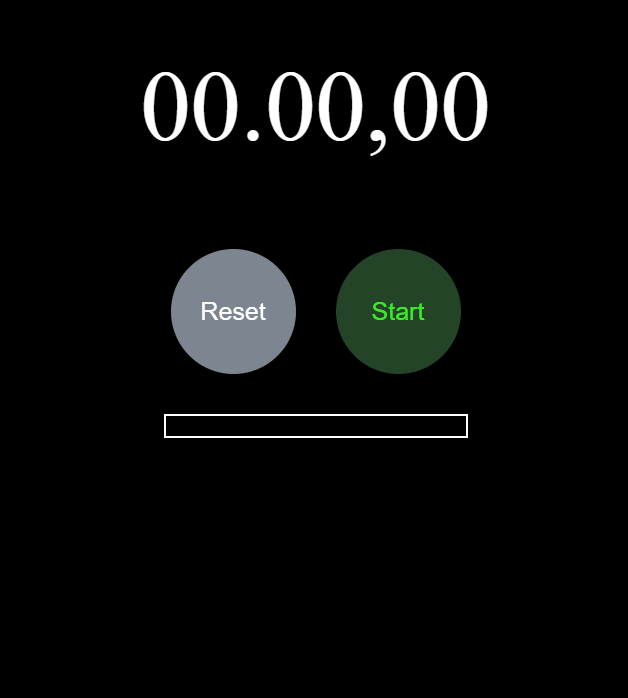

# ⏱ React Stopwatch

A simple and elegant stopwatch built with React and **Styled Components**.  
This mini project demonstrates fundamental React concepts such as state management, component structure, and custom styling through JavaScript.

## 🚀 Run locally

git clone https://github.com/MstowskaSandra/react-stopwatch.git
cd react-stopwatch
npm install
npm start

## 🧩 Features

- Start / Stop timer control  
- Reset timer and laps  
- Save lap times  
- Visual button color change based on state (running / stopped)  
- Fully styled with Styled Components  

## 🛠️ Tech Stack

- React 18  
- Styled Components  
- JavaScript (ES6+)  
- npm 
- Git

## ✨ What I learned

- Managing React component lifecycle with `useEffect`  
- Handling intervals and cleaning them to avoid memory leaks  
- Dynamic component styling with styled-components  
- Formatting and displaying time values clearly

## 📄 License

Created for educational purposes by Sandra Mstwoska.

